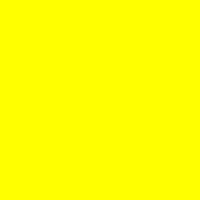

# Try It! Using For Loops

Make a yellow square that is 200 pixels wide and 200 pixels high, like this:



Think through the steps you will need to do to solve this problem. You will need to:

1. Create a new image, specifying that the new image is 200 pixels wide and 200 pixels high.

2. Then, for each pixel in that image:
   - Make the pixel yellow.

You can use the following line of code to create an image that is 2 pixels wide and 2 pixels high. This image will be all black. How would you create an image that is 200 pixels wide and 200 pixels high? Try it and see if you were correct!
```
var img = new SimpleImage(2,2);
print(img);
```
Once you have made the image, for each pixel you will need to change its color to yellow. What does it mean to make a pixel yellow? Remember that yellow pixels have a red value of 255, a green value of 255, and a blue value of 0.

## Extra Challenge!
What if you wanted to make your image magenta instead of yellow? Magenta has a red value of 255, a green value of 0, and a blue value of 255. You can experiment with other colors too!