# Rampup: Programming Exercise - Loops and Conditionals

## Exercise 1 - Turn the chapel red.

Write code that starts with the image “chapel.png” shown below on the left and turns the red part of every pixel to the highest red value possible, resulting in the image shown on the right.

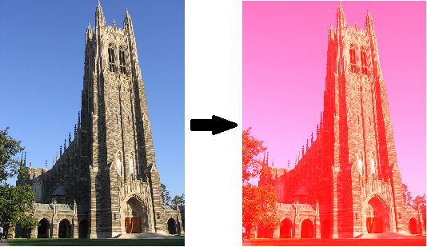

The code below has been started for you. It creates the variable image of type SimpleImage from the image file  chapel.png. It then loops over all the pixels making the red component as large as possible. Then it prints the resulting image. You need to replace the comment // missing code with the missing code.

### CODE:
```javascript
var image = new SimpleImage("chapel.png");

// missing code

print(image);
```

### OUTPUT:
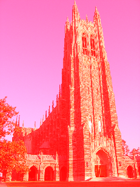

## Exercise 2 - Remove all the red

Write code that starts with the image “chapel.png” shown below on the left and removes all the red, resulting in the image shown on the right. You will notice that in the resulting image you will mostly see blue and green colors.

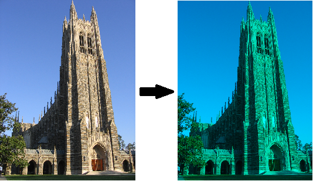

The code below has been started for you. It creates the variable image of type SimpleImage from the image file  chapel.png. It then loops over all the pixels removing all the red from the image. Then it prints the resulting image. You need to replace the comment // missing code with the missing code.

### CODE:
```javascript
var image = new SimpleImage("chapel.png");

// missing code

print(image);
```

### OUTPUT:
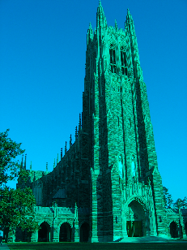

## Exercise 3 - Turn the eggs less red
Write code that starts with the image “eastereggs.jpg” shown below on the left and reduces all the red pixel values that are greater than 70 to 70, resulting in the image shown on the right. You will notice that in the resulting image you will see some reddish colors but no bright reds.

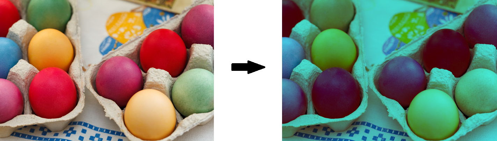

The code below has been started for you. It creates the variable image of type SimpleImage from the image file  eastereggs.jpg. It then loops over all the pixels replacing any red pixel values that are larger than 70 by 70. Then it prints the resulting image. You need to replace the comment
// missing code with the missing code.

### CODE:
```javascript
var image = new SimpleImage("eastereggs.jpg");

// missing code

print(image);
```

### OUTPUT:
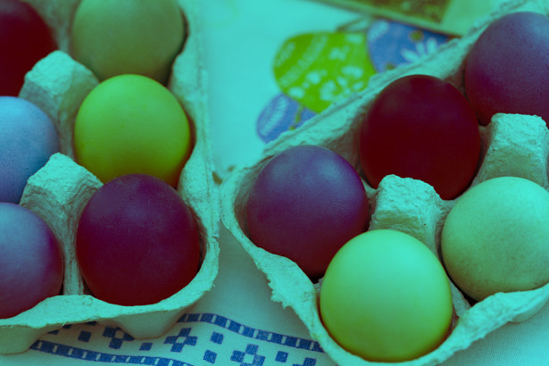

## Exercise 4 - Add Thick Black Line to Bottom of Owen

Write code that starts with the image “astrachan.jpg” shown below on the left and replaces the bottom ten rows with black pixels, resulting in the image shown on the right. Note that the color black has a red value of 0, a green value of 0 and a blue value of 0. Also note that the pixel in the top left corner has x-value 0 and y-value 0.

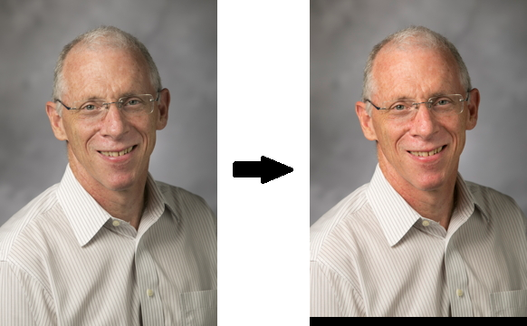

The code below has been started for you. It creates the variable image of type SimpleImage from the image file  astrachan.jpg. It then loops over all the pixels replacing only the pixels in the bottom ten rows with black pixels. Then it prints the resulting image. You need to replace the comment // missing code with the missing code.

### CODE:
```javascript
var image = new SimpleImage("astrachan.jpg");

// missing code

print(image);
```

### OUTPUT:


## Exercise 5 - Green square in top left corner

Write code that starts with the image “chapel.png” shown below on the left, and replaces the top left corner with an all green square of size 50 by 50, resulting in the image on the right below.

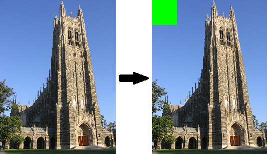

The code below has been started for you. It creates the variable image of type SimpleImage from the image file  chapel.png. It then loops over all the pixels replacing only the pixels in the top left corner of size 50 by 50 with all green. Then it prints the resulting image. You need to replace the comment // missing code with the missing code.

### CODE:
```javascript
var image = new SimpleImage("chapel.jpg");

// missing code

print(image);
```

### OUTPUT:
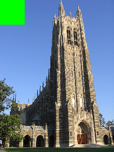

## Exercise 6 - Rectangle of any color in top right corner

Write a function named `topRightCorner` that puts a rectangle of a specified color and size in the top right corner of the image. The function `topRightCorner` has six parameters named `cornerWidth`, `cornerHeight`, `someImage`, `red`, `green`, and `blue`. This function replaces the top right corner of the image someImage with a rectangle of height cornerHeight and width cornerWidth, and color that has red, green and blue numeric values.

For example, the call result = topRightCorner(30, 60, picture, 255, 255, 0)

where picture is the simpleImage on the left below, followed by print(result) results in a yellow rectangle (all red and all green makes yellow) of width 30 and height 60  in the top right corner.

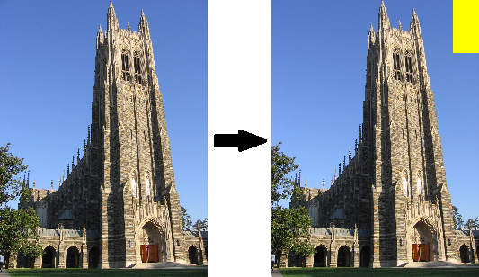

The call result2 = topRightCorner(125, 20, picture2, 255, 0, 0)

where picture2 is the simpleImage on the left below, followed by print(result2) results in a red rectangle of width 125 and height 20 in the top right corner.

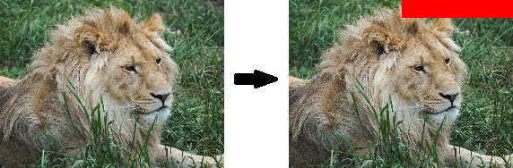

The code below has been started for you. It defines the function `topRightCorner`, creates a new SimpleImage and passes the SimpleImage to topRightCorner, which returns the image modified. It then creates another SimpleImage and passes it in another call to topRightCorner. You need to replace the comment // missing code  with the missing code.

### CODE:
```javascript
function topRightCorner(cornerWidth, cornerHeight, someImage, red, green, blue) {

    // missing code

}

var picture = new SimpleImage("chapel.png");
var result = topRightCorner(30, 60, picture, 255, 255, 0);
print(result);
var picture2 = new SimpleImage("smalllion.jpg");
var result2 = topRightCorner(125, 20, picture2, 255, 0, 0);
print(result2);
```

### OUTPUT:
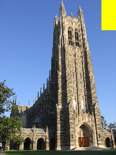
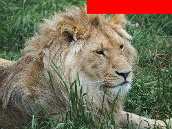

## Exercise 7 - Changes in Red

Write the function named `changeRed` that draws a rectangle of width 256 showing all the changes of the color red, from left to right repeatedly, while blue and green are both set to 0. With height set to 200, the resulting image is shown here.

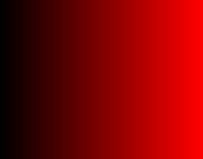

Here are more details. When one loops over pixels with a for loop, they are processed row by row starting with the top row and in each row they are processed from left to right. This function should start at the first pixel with red set to 0 and increment red by 1 with each new pixel it processes. Since the width is 256, the range of the color red goes from 0 to 255 as the row is processed. After the red reaches 255, it should be reset back to 0 for the next row. With red set to 0 on the right it looks like black. As the red number increases by 1 each time it eventually looks like bright red. 

The function `changeRed` has two parameters named `width` and `height` for the width and height of the rectangle. This function returns the newly created image. The function has been started below. You need to replace the comment // missing code  with the missing code.

### CODE:
```javascript
function changeRed(width, height) {
    var picture = new SimpleImage(width, height);
    var red = 0;

    // missing code

    return picture;
}

var result = changeRed(256,200);
print(result);
```

### OUTPUT:


## OPTIONAL: ONE CHANGE
Modify the function changeRed so that numbers for blue and green can also be passed in. Then the call with blue set to 200 and green set to 100 results in the picture:

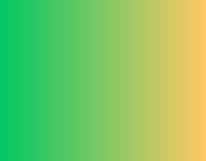