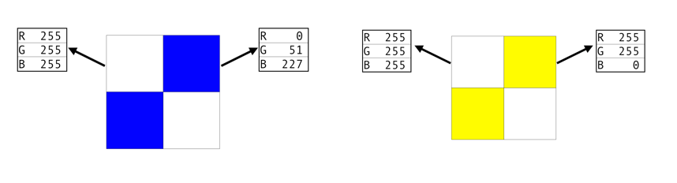

# Programming Exercise: Modifying Images

## Part 1
Write a JavaScript program that modifies an image by putting three vertical stripes on it - a red stripe on the left one third, a green stripe in the middle, and a blue stripe on the right one third. For example, if your program ran on Drew’s picture shown on the left, the resulting image would have red, green and blue vertical stripes as shown in the image on the right.

The red stripe is made by changing the `red component` of all the pixels in the `left vertical third` to 255, while leaving the green and blue components as their values in the original image. The green and blue stripes are made similarly, but instead of modifying the red component of each pixel in the correct part of the image you will modify the green or blue component. 

Let’s consider what steps your program will need to take in order to modify this image.

1. Start with the image you want to change. 
2. Figure out the width of the image. 
3. For each pixel in the image:
   - Get the x-coordinate for that pixel
   - If the pixel’s x-coordinate is less than one-third of the image’s width, set the pixel’s red value to 255.
   - If the pixel’s x-coordinate is between one-third and two-thirds of the image’s width, set the pixel’s green value to 255.
   - If the pixel’s x-coordinate is more than two-thirds of the image’s width, set the pixel’s blue value to 255.
4. Print the image.

You may find the following methods helpful in writing your program: 
- values() 
- getWidth()
- getX() and getY() 
- setRed(), setGreen(), and setBlue

## Part 2
Write a JavaScript function named swapRedGreen with one parameter pixel (representing a single pixel). This function should swap the red and green values of the pixel. For example, if you have a pixel with red = 255, green = 100, blue = 150, after calling swapRedGreen on that pixel its new RGB values would be red = 100, green = 255, blue = 150. 

To test your function, you should choose an image and apply the swapRedGreen function to every pixel in the image. The choice of your image is important. For some images you may not notice any change. What would happen if you used a completely black image, or a completely white image? What about an image with lots of red and not a lot of green? Think about what type of image you should use for testing your function. After choosing an image and applying the swapRedGreen function to every pixel in the image, make sure you print the resulting image so you can see whether your function worked correctly.  

## Part 3
Write code to change the Duke blue devil (the image below on the left) to be yellow (as in the image below on the right).

Start by working this smaller example by hand. You want to turn the image below on the left into the image below on the right. What are the steps you will need to take? Once you have worked through this example by hand to determine the steps you will need to take, you can translate your algorithm into code.  

Hint: You need to somehow identify the blue pixels. What makes the blue pixels different from the white pixels? What are some conditions you could use to identify the blue pixels?