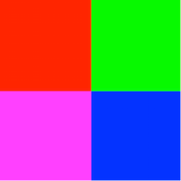

# Programming Exercise: Advanced Modifying Images

## Part 1 
Write the green screen algorithm you saw in the lecture video yourself. To make sure you really understand the code that was written in the video, you should write the code yourself without looking at the video unless you get stuck and need to refer back to it for a hint. 

## Part 2 
Your friend is trying to write a program that draws a square 200 pixels by 200 pixels and that looks like this square with colors red (red value 255), green (green value 255), blue (blue value 255) and magenta (red value 255 and blue value 255). All other RGB values are set to 0.



Your friend has written code to try to solve this problem, however their code has a bug, and produces this image:


Here is their code: 
```
var img = new SimpleImage(200,200);
for (var px of img.values()){
  var x = px.getX();
  var y = px.getY();
  if (x < img.getWidth()/2){
    px.setRed(255);
  }
  if (y>img.getHeight()/2){
    px.setBlue(255);
  }
  else {
    px.setGreen(255);
  }
}
print (img);
```

Your task is to find and fix the bug. Use what you have learned about applying the scientific method to debugging: gather information, apply your knowledge about images and programming, form a hypothesis, test your hypothesis, and finally, change the code to fix the problem.

## Part 3
Write a function named setBlack that has one parameter pixel (representing a single pixel) and returns pixel with its red, green, and blue components changed so that the pixel’s color is black.

Now you will write another function named addBorder. This function will add a black border to an image, such as in the following example:


On the left, we have the original image, and on the right, we have modified the image by giving it a black border that is 10 pixels thick. Note that the image size of the image with the border is the same as the original image because the border is not added around the outside of the original image, instead it covers up some of the original image.

Work through the seven steps to write this function. Work an example by hand and note the steps you took before translating your algorithm to code. Which pixels should be part of the border? How will you identify those pixels? Once you have identified them, how will you make them black?  

Hints: 
- The function will require two parameters: the image you want to modify, and the thickness of the border. Remember that you can name parameters whatever you want, but it is good to name them something informative. For example, in this case, you may want to use names like image and thickness. 
- Remember that you wrote a setBlack function. 
- Remember that images have a getWidth() method and a getHeight() method.

After you have written the function, test it by calling it with different border thicknesses. If anything is not working as expected, form a hypothesis about what is happening, gather information, test your hypothesis, and fix the code.