# Programming Exercise: TODO list

## Creating an Interactive TODO list
In this programming exercise you will write an interactive TODO list that you will be able to add items to, check the items off and remove the items. On the left below shows a TODO list with three items added to it, and on the right below shows the same TODO list in which the task walk dog has been checked off, swim laps has been removed from the list and write paper has been added to the list.

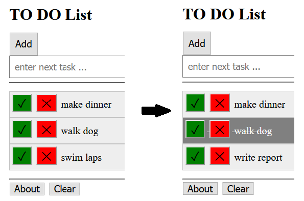

## Getting Started
You can go to this codepen site and make a copy of it by using the Fork button in the bottom right corner of your browser window.

https://codepen.io/shrodger/pen/yLeGvVO

Or copy the parts from below into a new pen on CodePen to get started. Put the HTML part in the HTML part of CodePen, put the CSS part in the CSS part of CodePen, and put the JavaScript part in the JavaScript part of CodePen. After putting in the starter code below, the webpage should look like this:

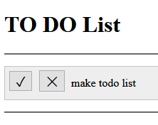

## Complete the Steps:
1. In the HTML part under `STEPs 1 and 2 below here`  add an <input> tag with attribute type=”button”. Include attributes id=”addButton” and value=”Add”. This input will be an Add button clicked by a mouse so you will also need to include an attribute onclick=”addTask()”, where addTask() is a function we have already started for you. Note that all these attributes must be inside the input tag, such as:
   ```html
   <input  type=”button” …    >
   ```
   You will see the add button appear. You can click it but nothing should happen yet.

   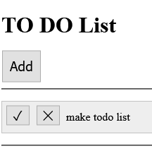

2. In the HTML part, right after the add button, add an input field so the user can type in text describing the next task. To do this add another `<input >` tag, this time with type=”text”, id=”input”, and placeholder=”enter task …”. Your web page should now look like this:

   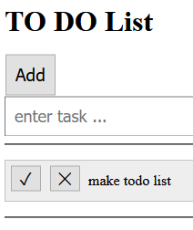

   Try it out! Enter in a task and click the Add button. I entered  the phrase, sign up for yoga, and you can see below that task was added!

   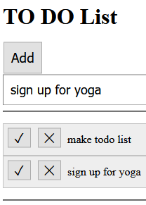

3. In the CSS part, let’s make the text in the list items larger. Find the definition for li, look for the comment: `/* step 3 below here */`. Then add another attribute to li, for font-size of 20px. Then you should see the todo items in larger font.

   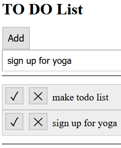

4. You may have noticed that after adding an item, it stays in the input field. Let’s fix that.

   In the JavaScript part, you will add to the end of the function addTask(). Don’t modify the first part of this function!

   At the end of the function addTask(), look for the comment  `/* Step  4 below here */` and add the following two items
   - a. To make the todo item typed in the input box disappear, set input.value to an empty string.
   - b. Change input.placeholder to set it to a new string such as “enter next task …”

   After fixing these two and adding the task “sign up for yoga” the web page should look like:

      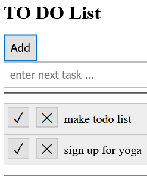

5. The check mark is to check off a task, and the X is to delete a task. Let’s change the colors for the check box to be green and the X box to be red.

    a. In the CSS, look for /* Step 5 below here */ and you will see the done class started for you. The class  done is the class for the button with the check mark. Add to this class to set the background-color to green. 

    b. The removeclass is the class for the button with the X mark. Right below the done class, add a class named remove and set its background-color to red.

    Now the menu should look like this.

    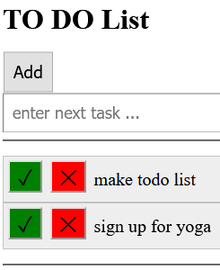

    Right now clicking the check mark doesn’t do anything but clicking the X box should delete an item. 


6. When you click on the check mark, the todo item should look like it is checked off. You will add formatting to make it look checked off with a line through it and changing some color. In the CSS part under /* Step 6 below here */ add the following to the li.finished definition

    a. Set color to white
    b. Set background-color to gray
    c. Set text-decoration to line-through

    Here is a picture of the list where `play with cat` has been checked off.

    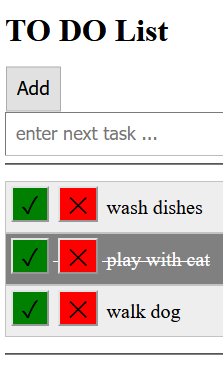

7. When you click on the red X, the todo item is deleted. Let’s change that so an item has to be checked off before it can be removed from the list.

    Here are the functions called in processing items. When you click on the red X the remove function is called.  When you click on the check mark the markDone() function is called. Both functions are in the javaScript part of CodePen. They look like this:
    ```javascript
    function markDone (item) {
        item.className = 'finished';
    }

    function remove (item) {
        // remove item completely from document
        item.remove();
    }
    ```

    You should modify the remove function so that it only removes an item if it has been checked off.

    Hint:  How do you know the item can be deleted? The item.className would have been set to ‘finished’. You need to check for that. 

    Try it out. Try deleting an item without checking it off. Then check it off and try deleting it. 


8. In the HTML add an empty div with id=”divabout” below where it says `STEPs 8 and 9 below here`. This div will be used to show information about the author of this website interactively in a few more steps.

9. Right below the div you just added, add a button that says About and have onclick call a function named doAbout(). Your view may look something like this but could be slightly different on different browsers. If you click on it nothing should happen yet.

    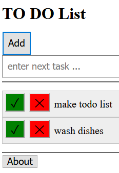

10. In the CSS pane, under `/* Step 10 below here */`, complete the class named aboutcolor to set the background-color to yellow. You won’t see anything happen yet after you do this.

11. In the JavaScript pane, under `/* Step 11 below here */`, complete the doAbout() function. This function should change the text in the div you created with id “divabout”. The text should say that you are the author. You might put something like this: “Author is Susan Rodger” but put your name. In addition the background color of the div should change to yellow. Be sure to use the class from step 10 to do that. 

    After completing this function, you should be able to click on the About button and see your name and the phrase highlighted in yellow like this (it will be a bit messed up!):

    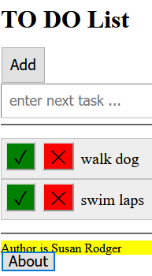

12. In the CSS pane under `/* Step 12 below here */`, complete the class name divabout to format the div to specify its width, to make its font-size larger, and to include a margin. I used a width of 300px, font-size of 20px and margin of 10px. Then the TODO list should look better, like this:

    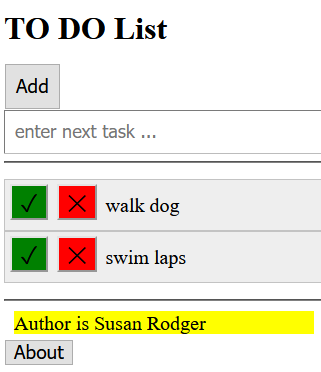

13. In the HTML pane, add a clear button to clear the about information, under `STEP 13 below here`. This input tag should have the onclick call the function clearAbout() that you will write in the next step. After adding the button your screen may look like this:

    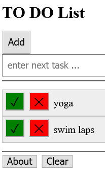

14. In the JavaScript pane, under `/* Step 14 below here */`, complete the clearAbout() function. This function should remove everything that was added to the div when About was clicked on. You will need to reset the text to an empty string. If there is no string to display, you won’t see any yellow, so you don’t need to do anything to the color. Then clicking on About will show information about the author and clicking on Clear will remove the information.

    Now you should have an awesome interactive TODO list!

## An Extra Challenge and More on How the Lists Work
### First, how the lists work in this exercise

You already know how lists work in HTML. You use `<ol>` or `<ul>` tags and for individual items in the list you use the `<li>` and `</li>`. In the code we gave you we already started an unordered list with two buttons, one a check mark ( `value="&#x2713;"` ) and one an X mark ( `value="&#x2713;"` ) and that said make todo list. That HTML code is here:

```html
<ul id="tasks">
   <li>
       <input type="button" class="done" onclick="markDone(this.parentNode)" value="&#x2713;" />
       <input type="button" class="remove" onclick="remove(this.parentNode)" value="&#x2715;" />
   make todo list
   </li>
</ul>
```

In the JavaScript function addTask(), it has to recreate this `<li>` item that has two buttons and a phrase. That is done by making a huge string in single quotes (since we use some double quotes in that string). Here is that function (without your additions):

```javascript
function addTask () {
    var input = document.getElementById("input");
    // get current text from input field
    var newTask = input.value;
    // only add new item to list if some text was entered
    if (newTask != "") {
        // create new HTML list item
        var item = document.createElement("li");
        // add HTML for buttons and new task text
        // Note, need to use '' because of "" in HTML
        item.innerHTML = '<input type="button" class="done" onclick="markDone(this.parentNode)"  value="&#x2713;" /> ' + '<input type="button" class="remove" onclick="remove(this.parentNode)" value="&#x2715;" /> ' + newTask;
        // add new item as part of existing list
        document.getElementById("tasks").appendChild(item);  

        // your code not shown for Step 4
}
```

Here is what this procedure is doing. 

In the first line it sets the variable input to the canvas. Then in the second line it assigns to the variable newTask the task the user has typed in, if they typed something in (there is nothing to add otherwise). Then the variable  item is set to a  new li item. In the next several lines, item.innerHTML is set to a huge string of the list item which includes the two buttons and the phrase of the task. There is the first button surrounded by single quotes, followed by a + since we are adding (or concatenating ) strings, followed by the second button surrounded by single quotes and a + and then newTask, the string the user entered. The next line uses the appendChild method with item to make this new list item appear. We will be learning more about lists and arrays, and appending items to lists later.

### The Challenge - Add an Important button
Add an important button to each list item so you can mark which items should have priority. Here is an example. There are three tasks and one of them, write paper, has been highlighted as important by clicking the ! button.

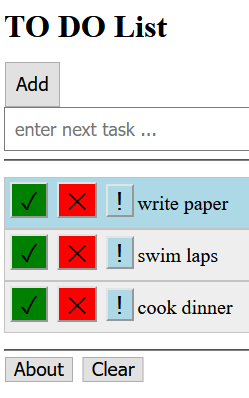

### Complete the Steps:

1. `In the HTML add an important button right after the X button by doing the following`
    - a. Create an `<input … />` tag with what type?
    - b. Set the  class to ”important” and the  value to ”!”
    - c. Set onclick to call a new function named important. (see how the other functions are called). 

    You should see:

    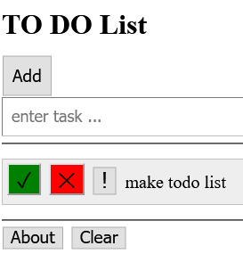

2. In the CSS, create an important class with background-color lightblue. The result should look like:

    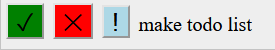

3. In the JavaScript, write a new function named important that has one parameter nameditem. You can start with:
    ```javascript
    // highlight item from document
    function important (item) {

    }
    ```

    You should set item.className to ‘important’. Now when you click on the important icon, the whole line will be highlighted in blue!

    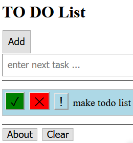

4. Try adding a second item. It does not have the important button! That is because you modified the list item in the HTML but not the list items that are added. To do that, in the JavaScript pane,  you will need to expand the huge string in the addTask function. Do the following:
    - a. Copy your `<input  …  />`  important button from the HTML pane.
    - b. In the JavaScript pane, in the addTask function add it at the end of that huge string, between the + and `newTas`k;
    - c.In the JavaScript pane, in the addTask function add it at the end of that huge string, between the + and newTask;
    - d. You will need to add a + between the `<input … />` button and newTask;

    Now when you add new items they should have the important button!

