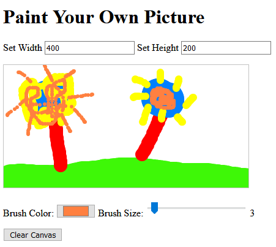
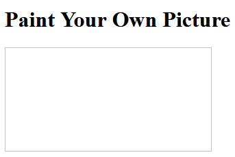
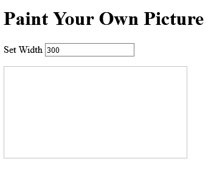
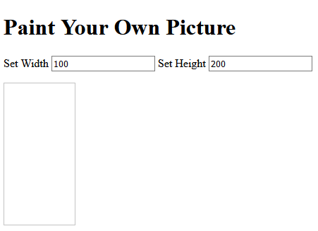
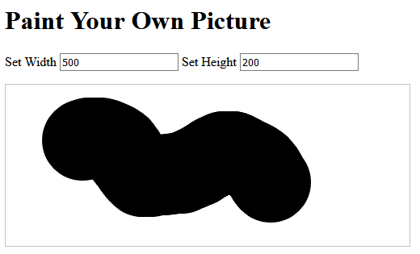
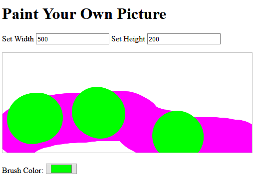
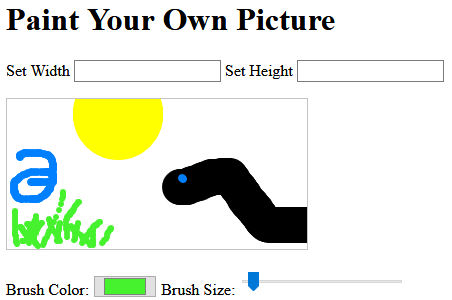
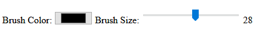
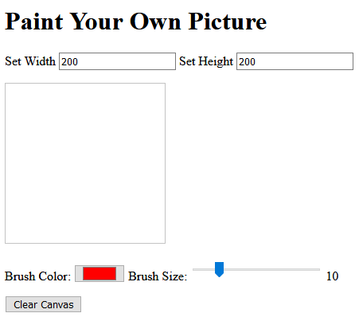

# Programming Exercise: An Interactive Paint Canvas

## Creating an Interactive Painting Canvas
In this programming exercise you will use CodePen to write an interactive Paint canvas for which you will be able to draw pictures, resize the canvas and clear the canvas.



### Getting Started
You can go to this codepen site that has some JavaScript starter code and make a copy of it by using the Fork button in the bottom right corner of your browser window.

https://codepen.io/shrodger/pen/jOqOKoL

Or create a new CodePen pen and copy the JavaScript code from below into the JavaScript part to get started.  After putting in the starter code below, the webpage will still be blank. You will be writing most of the code for this assignment. 

This starter code is NOT complete and may show an error saying `TypeError: the paintcanvas is null`. You will need to add code to make that error message go away. 


### Here is the JavaScript Starter:
```
var paintcanvas = document.getElementById("canvas1");
var context = paintcanvas.getContext("2d");
var color = 'black';
var radius = 50;
// only paint if mouse is being dragged (moved while the button is pressed)
var isPainting = false;

function setWidth (value) {

}

function clearCanvas () {
    context.clearRect(0, 0, paintcanvas.width, paintcanvas.height);
}

function paintCircle (x, y) {
    // make sure to start a new circle each time
    context.beginPath();
    // draw circle using a complete (2*PI) arc around given point
    context.arc(x, y, radius, 0, Math.PI * 2, true);
    context.fillStyle = color;
    context.fill();
}

// verify the given value is actually a number
function isNumeric (value) {
    // standard JavaScript function to determine whether a string is an illegal number (Not-a-Number)
    return !isNaN(value);
}
```

### What you are given
The JavaScript code you are given starts with several globally defined variables that will be used by many of the functions and some of the functions may change their values. Those variables are:
1. `paintcanvas` that identifies the canvas from the HTML code
2. `context` that refers to the 2D context of the canvas, or the values of its properties like size, drawing color, etc.
3. `color` defines the color the paintbrush will be painting. You will be referring to the color and also changing the color.
4. `radius` defines the radius of the circle that the paintbrush will be painting. You will be able to change its value.
5. `isPainting` is a boolean control that indicates whether or not the paintbrush is painting (drawing circles on the canvas) while the mouse is moving.

You are also given three complete functions and one empty function
1. The function `setWidth` is empty. You will fill it in later to change the width of the canvas. 
2. The function `clearCanvas()` clears the canvas by erasing a rectangle the entire size of the canvas
3. The function `paintcircle(x,y)` paints a circle at location (x,y) on the canvas that is of color the global variable `color`, and has radius the global variable `radius`. 
4. The function `isNumeric(value)` returns true if the parameter value is a numeric value and returns false if it is not. For example `isNumeric(“100”)` would return true and `isNumeric(“300px”)` would return false. You will use this function to determine if the user typed in a valid number.

### Complete the Steps
1. Let's start by adding a title to the page and a canvas element. In the HTML part:
    - a. Add an `<h1>` header with words such as Paint Your Own Picture.
    - b. Add a _canvas_ element with _id=”canvas1”_. You should not be able to see the canvas yet. There should be a separate end canvas tag `</canvas>`.

2. Let’s put a border around the canvas so we can see it. In the CSS part:
    
    Define a canvas style rule that defines the canvas border as 1px and a grayish color:
    ```
    canvas {
        MISSING LINE HERE
    }
    ```
    Now you should be able to see your header and the outline of the canvas as:

    

3. Let’s add code to change the width of the canvas.
    - a. First in JavaScript, complete the empty function `setWidth` that has been started for you. The function `setWidth` has a parameter named `value`. This function should first make sure that `value` is a valid number (by calling the function `isNumeric` that is provided for you) and then, if it is,  change the variable `canvas.width` to value.
    - b. Next, let’s add an input box so the user can specify the width of the canvas. In the HTML, right above the canvas, add a paragraph `<p> </p>` and inside the paragraph add:
        - i. the words “Set width”
        - ii. followed by an `<input />` tag with the following inside the tag: type=”text” and onchange set to call the setWidth function with input this.value
    - c. Your webpage should now look like this and you should be able to enter in a number, say 300 and see the width of the canvas change.

    

4. Now add code to change the height of the canvas.
    - a. First in JavaScript, write the function `setHeight`. The function `setHeight` has a parameter named `value`. This function should first make sure that value is a valid number and then, if it is,  change the variable `canvas.height` to value. 
    - b. In the HTML, inside the same paragraph for the `<input>` tag we just created add:
        - i. the words “Set Height”
        - ii. followed by an `<input />` tag with type=”text” and onchange set to call thesetHeight function with argument “this.value”.
    - c. Your webpage should now look like this and you should be able to enter in a width, say 100 and a height, say 200, and see the canvas change shape:

    

5. Now let’s start painting. You will need to add some functions to the JavaScript window.
    - a. Add the function named `startPaint()` that has no parameters. This function just needs to set the variable named `isPainting` to true to indicate it is time to start painting.
    - b. Add the function named `endPaint()` that has no parameters. This function ends the capability to paint by setting `isPainting` to false. 
    - c. Add the function named `doPaint` that has two parameters named `x` and `y`. This function checks to see if it is ok to paint (it is ok to paint if the variable `isPainting` has the value true) and if so it draws a circle at position x and y, with radius set to `radius` and color set to color. Hint: Call the `paintCircle` function.
    
    You won't be able to paint yet. 

6. Now add mouse control to the canvas so you can paint. In the HTML window inside the `<canvas  >` tag add the following:
    - a. Add _onmousedown_ attribute to start painting when you click the mouse by giving it the value to call the `startPaint()` function. That is, you should add this attribute inside the `<canvas>` tag already there, right after the id attribute so it looks like: 
    ```
    <canvas id="canvas1" onmousedown="startPaint()" >
    ```
    - b. Add _onmousemove_ attribute so painting continues as the mouse moves. It should have the value of calling the `doPaint()` function and pass the two arguments _event.offsetX_ and _event.offsetY_ which are the current position of the mouse within the canvas no matter where it is positioned on the web page. This should also be inside the same `<canvas>` tag.
    - c. Now try clicking and moving the mouse inside the canvas. You can draw a big black circle over and over. Note you can’t stop it. You will fix that next. 
    - d. Add _onmouseup_ attribute to end the painting when you let go of the mouse. You should give it the value of calling the `endPaint()` function. This should also be inside the same `<canvas>` tag.
    - e. Now try clicking and dragging the mouse and letting go of it and it should stop.
    - f. Here is a picture of painting the big black circle several times.

    

7. It would be nice to paint with different colors. To do this add the following.
    - a. In the JavaScript window, add the function named `changeColor` that has one parameter named newColor. This function should change the variable named `color` to the value `newColor`.
    - b. In the HTML window, below the canvas, add a paragraph `<p> </p>` and inside the paragraph add the following:
        - i. Put the words: Brush color
        - ii. Right after that, add another `<input />` tag with the values inside of the tag
            1. type should be set to “color”
            2. value should be set to “#000”
            3. _onchange_ should call the function `setColor` with argument _this.value_, and the call should all be in quotes.
    - c. Now select a different color and paint. Then another color and paint on top. Here is an example of painting with pink and green.

    

8. Now let’s change the size of the circle we are painting by adding a slider.
    - a. In the JavaScript window, add the function named `resizeBrush` that has one parameter named `newSize`. This function should 
        - i. Set the variable named _radius_ to the value _newSize_
        - ii. Set _document.getElementById("sizeOutput").value_ to  _newSize_
    - b. In the HTML window, in the `<p>` where we added the color button, right after the color button and still inside the `<p>    </p>` add:
        - i. Put the words: Brush size:
        - ii. Then add another `<input />` tag with the values inside of the tag
            1. _type_ should be set to _“range”_, that makes it a range slider.
            2. _id_ should be set to _“sizeInput”_
            3. _min_ should be set to _“1”_
            4. _max_ should be set to _“50”_
            5. _value_ should be set to _“50”_
            6. _oninput_ should call the function `resizeBrush` with argument _this.value_, and the call should all be in quotes.
    - c. Try painting with different colors now. You should see something like this:

    

9. Let's add an output to show the value of the slider.
    - a. Right after the end of the tag `<input />` from the last step and still in `<p> </p>`, add an `<output>` start and end tag around the number 50, and inside the `<output >` tag set the id to “sizeOutput”. It should look like the following:
      ```
      <output id="sizeOutput">50</output>
      ```
    - b. Now move the slider and you should see the value change, getting smaller as you move the slider to the left and larger as you move the slider to the right.
    - c. It may look like this:

    

10. Let’s add a button to clear the canvas so you can start painting again. 
    - a. In the HTML window pane at the bottom, add the following:
        - i. Add in a new paragraph with tags `<p>` and `</p>`
        - ii. Between the starting and ending `<p>` tags, add an `< input />`  button with the following values inside this tag:
            1. The _type_ is set to _“button”_
            2. The _id_ is set to _“clear”_
            3. The _value_ is set to _“Clear Canvas”_
            4. The _onclick_ is set to call the function _“clearCanvas()”_, a function we have provided for you that erases a rectangle the entire size of the canvas
    - b. You should now see the Clear Canvas button and after drawing  you should be able to clear the canvas. Your webpage might look like this:

    

Now you have an awesome interactive Paint program!