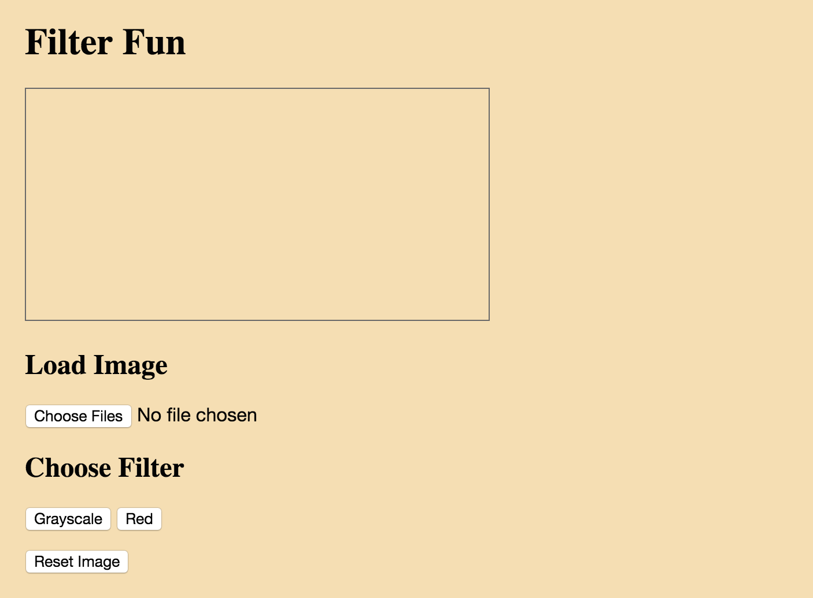
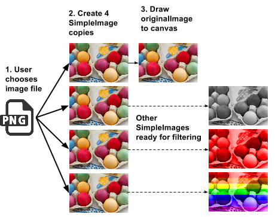
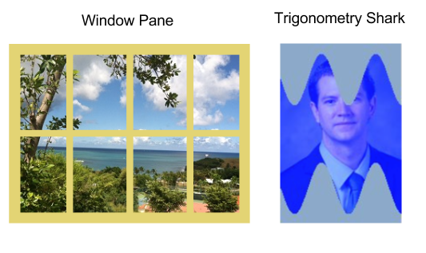
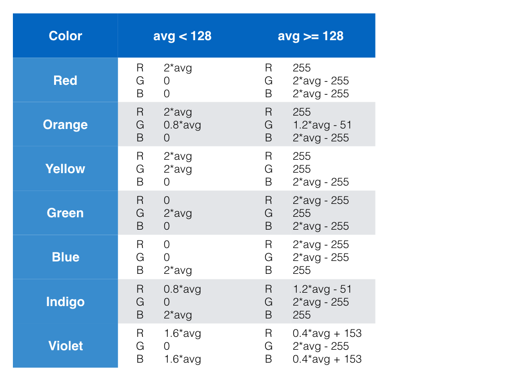
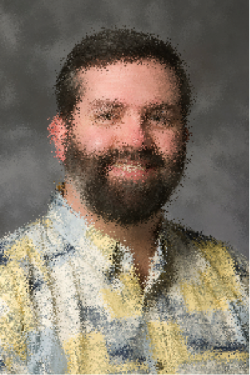

# MiniProject Part 1
- Congratulations! You are ready to implement what you have learned in this course in the culminating MiniProject. In this assignment, you will build an interactive web page where a user can upload an image and apply filters to it, including at least one filter designed by you. 

When you are finished, someone visiting your page should be able to:

Upload and display an image

Apply at least three filters to the image

Reset the image to its original version

## Make a Prototype
As you learned in the Event-Driven Programming lesson, it is useful to make a prototype web page as the first step toward a sophisticated interactive web page. 

For this MiniProject, start by creating the layout for your web page:

1. Add your HTML elements. Specially, your prototype page should have: 
   - A heading and subheadings
   - A canvas
   - A file input element, which only allows the user to upload a single image file
   - At least 3 buttons, one for each image filter you will create
   - A fourth button to “reset” the image (i.e., show the original/unfiltered image)

2. In the JavaScript panel, create at least 5 functions, one for each of your input elements. Be sure to name the functions clearly (e.g., if a function is supposed to load an image to the canvas, perhaps name the function loadImage()). For the time being just have the functions alert the user that the button or file input has been used.

3. Have the event handlers for each of your input elements call the appropriate function (e.g., onclick, onchange, etc.).

4. Be sure to use CSS to style your web page in a way that appeals to you. Experiment with margins and padding, and find new colors and font styles to make the page look great! Check out W3School’s resources for CSS: http://www.w3schools.com/css/. 

Here is a screenshot of an example prototype page. Feel free to structure and style yours however you want. Just make sure you have the canvas and input elements described above.



## Grayscale Filter
1. Plan your code
   
   Let’s begin to think through how the JavaScript code should be organized. When the user clicks the “Choose Files” button and selects an image file, your web page will create a SimpleImage variable of the image file and draw it to the canvas. Then, your user can apply any one of your filters to the image. 
   
   But what happens if the user applies one filter and then wants to switch to another filter? How can you let the user use one filter and then return to the original image to apply another filter? One way to solve this problem is to have your image loading function create a copy of the image for each filter the user could click. That way, you can manipulate one version of the image, while preserving a copy of the original image.
   
   The image below demonstrates the planning for a page that has three filters but needs to retain a copy of the original image.

   

   Since you will want to load the images in one function and process them in another, it is convenient to make them global variables. You may also want to initialize them to null, so that you can check if they have loaded later. Since you will make changes to the canvas element from multiple functions, it is convenient to make this a global variable too.

   Another programming decision you will need to make is what the reset button should do. Should it display the original image? Should it also reset all of the image variables to the original image?

2. Complete image loading function
   
   Implement your image loading function so that when the Choose Files button is clicked, the image is uploaded and displayed on the canvas. You may also want to set your global image variables to copies of the original image at this point. 

3. Implement the grayscale filter
   
   You have practiced implementing grayscale on a web page before. In this version, we suggest you make two changes to your code organization, but the main algorithm will be the same. The changes are: 

   a. Check that the copy of the image for this filter has loaded before you apply the filter to it. It is convenient to use a helper function for this that takes an image as a parameter and returns true if the image is complete and not null, and otherwise alerts the user the image is not loaded and returns false. Refer to your green screen code for an example of this kind of check and write this helper function now.

   b. Put the actual image modifying steps in a helper function. This means you can separate the image modification from the image loading, the check, and displaying the final image on the canvas.

   An example of the function triggered by the grayscale button could be:

   ```javascript
    function doGray() {
        if ( imageIsLoaded(grayImage) ) {     // check if image is loaded
            filterGray();	                      // function performs the grayscale work
            grayImage.drawTo(canvas);	          // display image
        }
    }
   ```

   This function calls the helper function imageIsLoaded(), which will return either true or false, then calls the helper function that does the grayscale algorithm, then draws the grayscale image to the canvas.

   Make sure to test that your grayscale filter is applied when you click the grayscale button! Also check that your reset button displays the original image, and that your code alerts you if you click the grayscale filter button before an image has been loaded.

4. Complete reset button
   
   Write a reset function that will be called by your reset button’s event handler. The function should:
   - Check if the original image is loaded.
   - If the image is loaded: display it on the canvas, and reset all of the global variables for filter images to the original image. This way, if you run one of your filters after resetting, the filter will run on the original image, not on the already filtered image.

# MiniProject Part 2

## Red Filter
1. Translate red filter algorithm to code
   
   Now that you have implemented the grayscale image filter, it is time to try an unfamiliar image filter algorithm: a red hue filter. Below is one possible algorithm for the red filter.

   For each pixel in the image:
   - Calculate the average of the pixel’s RGB values 
   - If the average is less than 128: set the pixel’s red value to two times the average, set the pixel’s green value to zero, and set the pixel’s blue value to zero.
   - Otherwise: set the pixel’s red value to 255, set the pixel’s green value to two times the average minus 255, and set the pixel’s blue value to two times the average minus 255.

   Using the DukeLearnToProgram JavaScript environment, translate the above red filter algorithm into JavaScript. Test with different images to make sure that your code is working correctly. What types of images would be good to test the code with?

2. Add red filter to web page
   
   Once you have implemented the red filter in DLTP, add it to your web page. We suggest using the same approach as with the grayscale filter: have one function that actually modifies the image (in the grayscale example, this function was makeGray), then have another function (in the grayscale example, this function was doGray) that checks that the image is loaded, calls the function that modifies the image, and displays the filter on the canvas.

   Try your red filter button to see if it works! Try pressing your red filter button several times. What happens to the image? What happens if you now click the grayscale filter button, then the red filter button?

   This is a great time to check whether your reset button works properly and resets all the filter images to the original image, so that the next time you run the filters they run on the original image, not on the already filtered image.

## Design your own filter
As the final part of your MiniProject, design and program your own image filter. It can do whatever you want, but it should be something original, not one of the filters you have seen in the class. Here are a couple of examples.



In these examples, pixels are manipulated based on where they are in the image, as well as their RGB values. You can can also include more complex math operations with JavaScript’s Math object methods: http://www.w3schools.com/js/js_math.asp. 

Be creative!

Once you have decided what you want your filter to do, you should follow the seven step process: 
1. Work some small examples (i.e., a few to several pixels) by hand. 
2. Write down the steps you took. Be very specific—this will help in translating to code later. 
3. Look for patterns and generalize your solution. 
4. Check your algorithm by hand on a few small examples to make sure you have not missed anything. 
5. Once you are satisfied that your algorithm does what you want it to, translate it to code. You should develop your code in the Duke environment on the course site: http://www.dukelearntoprogram.com/course1/example/index.php (linked in the Resources tab as well). Later you will put this code on your web page. 
6. Test your code. Think of what types of images would be good to try your filter on. 
7. Debug any problems in your code.

Once your code is working in the Duke environment, add it to your web page as you added the grayscale and red filters and test it by uploading a few different images to your web page.

## Personalize and share
The appearance of your web page is up to you! You should think about how you want to structure and style your web page using the HTML and CSS you have learned.

Once you have a version you would like to share, post a link to your pen in the forum “Share Your Success.” Check out some of the other learners’ projects, and give them your feedback!

# MiniProject Challenge

## Challenge: Rainbow Filter
As a challenge project, add a button to give an image a rainbow-colored filter. Try creating seven horizontal stripes, evenly spaced across the image, and give each one a different hue filter, such as red, orange, yellow, green, blue, indigo, and violet.

For example, here is the lion.jpg image with a rainbow filter.


1. Rainbow filter algorithm
   
   For each pixel in the image, first calculate the average of the pixel’s RGB values, then find the appropriate formula in the table:

   

2. How to make a filter in any color
   
   The values in the table were determined by plotting a piecewise linear function for each of the R, G, and B values vs. the average value. To keep black pixels black and white pixels white, the desired functions are pinned at (0,0) and (255,255). The third point (where the function changes slope) is determined by plotting the R, G, or B value of the desired color vs. 127.5.

   Consider any color any color with R value = Rc, G value = Gc, and B value = Bc. The filtered pixel has R value:

   ```
   R	= Rc/127.5*avg                      for avg < 128
    (2 - Rc/127.5)*avg + 2*Rc - 255   for avg >=128
   ```

   Similarly for G and B, where you would substitute Gc or Bc for Rc in the above formula.
   
   To apply this formula and create a colored filter of your choice, use a color picker tool to determine the RGB content of any color you would like to use, such as teal (17,170,153). 

   Since for teal, Rc = 17, Gc = 170, Bc = 153, so
   
   ```
   R = 17/127.5*avg                      = 0.13*avg        for avg < 128
    (2 - 17/127.5)*avg + 2*17 - 255	  = 1.87*avg - 221  for avg >=128

   G = 170/127.5*avg                     = 1.33*avg        for avg < 128
    (2 - 170/127.5)*avg + 2*170 - 255	= 0.67*avg + 85   for avg >=128

   B = 153/127.5*avg                     = 1.2*avg         for avg < 128
    (2 - 153/127.5)*avg + 2*153 - 255	= 0.8*avg + 51    for avg >=128
   ```

   Now you can use this formula to make a filter in any color!

## Challenge: Blur Filter
One way to create a simple blur filter is to scramble pixels that are near each other. For example, you could turn this image:


into this image:



Let us consider how to achieve this effect. 

We begin by creating a blank image. For each pixel we will do one of two things: half the time, we will simply copy the pixel from that location in the old picture. The other half of the time we will find a pixel nearby and copy that pixel instead. We will do this by generating a random number between 0 and 1. If the random number generated is less than 0.5 (which it will be approximately half the time), we will copy the pixel from the old picture. Otherwise, we will find and copy a nearby pixel. 

We must figure out how to find a "nearby" pixel. We will define some value for how far away the new pixel will be (say, 10 pixels) and then we write a function that will give x and y coordinates that are a random amount between 0 and 10 pixels away. For example, it could give a pixel that is 5 pixels to the left and 3 pixels higher. 

Before we use these coordinates to get a new pixel, we must check that the new coordinates still give a valid pixel in the image. For example, imagine we are finding a pixel to replace a pixel at the very top of the image. The function that generates coordinates gives us a point that is 3 pixels up, but since we are on the top of the image (y = 0) we cannot go up by three pixels (y would be -3)! If the random number is too big (larger than the width-1 or height-1) or too small (less than 0) then we will just use the closest number that is valid. 

Once we have a valid pixel that is some amount away, we use its red, green, and blue values as the new pixel's values.

## Note about CSS Filters
Some image filters can be implemented in CSS, using the CSS filter property (see http://www.w3schools.com/cssref/css3_pr_filter.asp ). For example, you can make an image grayscale using CSS. We have shown grayscale in JavaScript to give an idea of what types of things you can do with programming. JavaScript also allows you to go far beyond the filters offered by the CSS filter property and build or customize a filter to do exactly what you want it to.