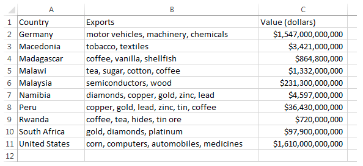

# Programming Exercise: Parsing Export Data

The CSV file __exportdata.csv__ has information on the export products of countries. In particular it has three column headers labeled __Country__, __Exports__, and __Value (dollars)__. The __Country__ column represents a country from the world, the __Exports__ column is a list of export items for a country, and the __Value (dollars)__ column is the dollar amount in millions of their exports in the format of a dollar sign, followed by an integer number with a comma separator every three digits from the right. An example of such a value might be “$400,000,000”.

The CSV file __exports_small.csv__ is a smaller version of the file above with the same columns that you may find helpful in testing your program. We show a picture of it here.



__Write the following program.__ Be sure to see the sample program in this lesson's videos.
1. Write a method named __tester__ that will create your CSVParser and call each of the methods below in parts 2, 3, 4, and 5. You would start your code with:
    ```java
    FileResource fr = new FileResource();
    CSVParser parser = fr.getCSVParser();
    ```
    Each time you want to use the parser with another method, you will need to reset the             parser by calling fr.getCSVParser() again to get a new parser.
    ```java
    parser = fr.getCSVParser();
    ```
2. Write a method named __countryInfo__ that has two parameters, __parser__ is a __CSVParser__ and __country__ is a String. This method returns a string of information about the country or returns “NOT FOUND” if there is no information about the country. The format of the string returned is the country, followed by “: “, followed by a list of the countries’ exports, followed by “: “, followed by the countries export value. For example, using the file __exports_small.csv__ and the country Germany, the program returns the string:
    ```
    Germany: motor vehicles, machinery, chemicals: $1,547,000,000,000
    ```
3. Write a void method named __listExportersTwoProducts__ that has three parameters, __parser__ is a __CSVParser__, __exportItem1__ is a String and __exportItem2__ is a String. This method prints the names of all the countries that have both __exportItem1__ and __exportItem2__ as export items. For example, using the file __exports_small.csv__, this method called with the items “gold” and “diamonds” would print the countries
    ```
    Namibia
    South Africa
    ```
4.  Write a method named __numberOfExporters__, which has two parameters, __parser__ is a __CSVParser__, and __exportItem__ is a String. This method returns the number of countries that export __exportItem__. For example, using the file __exports_small.csv__, this method called with the item “gold” would return 3.
5. Write a void method named bigExporters that has two parameters, parser is a CSVParser, and amount is a String in the format of a dollar sign, followed by an integer number with a comma separator every three digits from the right. An example of such a string might be “$400,000,000”. This method prints the names of countries and their Value amount for all countries whose Value (dollars) string is longer than the amount string. You do not need to parse either string value as an integer, just compare the lengths of the strings. For example, if bigExporters is called with the file exports_small.csv and amount with the string $999,999,999, then this method would print eight countries and their export values shown here:
    ```
    Germany $1,547,000,000,000
    Macedonia $3,421,000,000
    Malawi $1,332,000,000
    Malaysia $231,300,000,000
    Namibia $4,597,000,000
    Peru $36,430,000,000
    South Africa $97,900,000,000
    United States $1,610,000,000,000
    ```