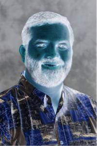
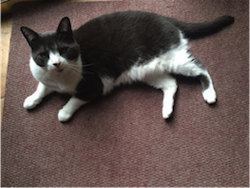
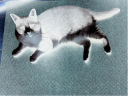

# Programming Exercise: Batch Grayscale and Image Inversion

## Assignment 1: Batch Grayscale
You have learned how to convert an image to grayscale, and how to select and process several images to convert them to grayscale and display them. You also learned how to copy an image and save it with a different filename. Now put this all together in one program that batch processes several images, and creates and saves new images (with new filenames) that are grayscale versions of each image.

More specifically,
- Your program should let the user select multiple image files
- For each image, create a new image that is a grayscale version of the original image
- For each image, save the grayscale image in a new file with the same filename as the original image, but with the word “gray-” in front of the filename. For example, if the original file was named lion.png, the new image would be a grayscale image and be named gray-lion.png.

Hint: Start with the Batch Grayscale program that processes many images, and add in code to save those files with new names.

## Assignment 2: Image Inversion
Write a program to create new images that are photographic negatives (or inverted images) of selected images and save these new images with filenames that are related to the original images, such as adding “inverted-” in front of the old filename. In inverting an image, a pixel’s red, blue, and green components are modified to be the exact opposite within the 0 to 255 range. That is, if a pixel’s red, blue, and green values are (34, 198, 240), then that same pixel in the inverted image would have the red, blue and green values of (221, 57, 15). Note that 255 - 34 is 221, 255 - 198 is 57, and 255 - 240 is 15.

For example, see the original and inverted images of Robert.

<table>
  <tr>
    <td></td>
    <td></td>
  </tr>
 </table>

Here is another example. The second image below is the inverted image of the first image.

<table>
  <tr>
    <td></td>
    <td></td>
  </tr>
 </table>

To tackle this problem:
1. First think about how to create a new image that is the inverse of another image.
2. Start by solving an example by hand, write down the steps, find patterns and then test the algorithm
3. Then create a new BlueJ class called __BatchInversions__. In this class create a method named __makeInversion__ that has one parameter, an image, and returns a new image that is the inverse of the original image.
4. Then add another method called __selectAndConvert__ to handle the batch processing of files. This method allows the user to select several files and display the images. Test this method to make sure it works.
5. Then modify the __selectAndConvert__ method to save each inverted image as a file with a new filename. Use the old filename and append to the front of it “inverted-”