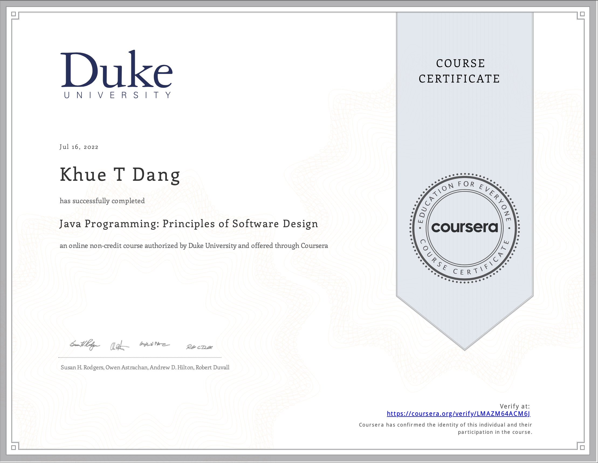

# Java Programming: Principles of Software Design

- This directory contains all of my assignments from the Coursera Course: [Java Programming: Principles of Software Design](https://www.coursera.org/learn/java-programming-design-principles?specialization=java-programming)

