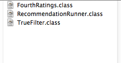
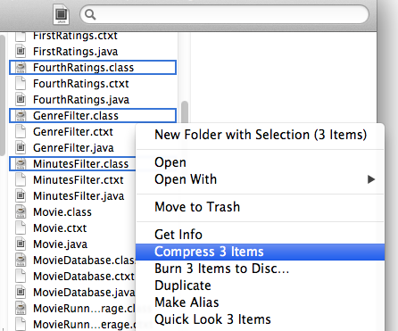
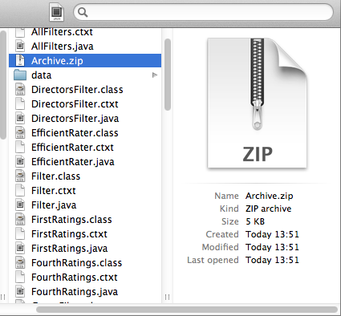
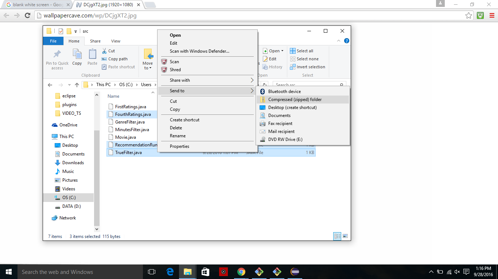
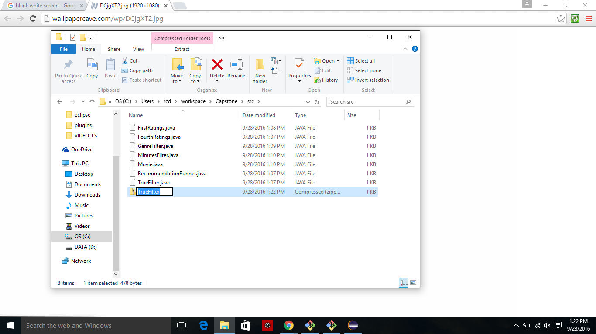

# Programming Exercise: Step Four

_Provided starter files can be found at: http://www.dukelearntoprogram.com/course5/index.php_

In this exercise you will continue to build on the program you wrote for the previous assignment. You will continue to make your program more efficient with a RaterDatabase class that is designed and implemented similarly to the MovieDatabase class you used recently—you will use both of these database classes in this assignment. You will also calculate a different kind of average movie rating, one based on weighting ratings made by raters who are more like you, or like any given rater—valuing their ratings more than raters who don't have your tastes in movies. To calculate these weighted averages you will need to calculate similarity scores for each rater to find out which raters you are more similar to than others, so you can weight ratings accordingly.

## Additional File for Assignment
For this assignment you will be given one class RaterDatabase, which is an efficient way to get information about raters. This class contains:
- A HashMap named ourRaters that maps a rater ID String to a Rater object that includes all the movie ratings made by this rater. 
- A public static initialize method with one String parameter named filename. You can call this method with the name of the file used to initialize the rater database.
- A private initialize method with no parameters that initializes the HashMap ourRaters if it does not exist. 
- A public static void addRatings method that has one String parameter named filename. You could alternatively call this method to add rater ratings to the database from a file. 
- A public static void addRaterRating method that has three parameters, a String named raterID representing a rater ID, a String named movieID that represents a movie ID, and a double named rating that is the rating the rater raterID has given to the movie movieID. This function can be used to add one rater and their movie rating to the database. Notice that the method addRatings calls this method. 
- A method getRater has one String parameter named id. This method returns a Rater that has this ID. 
- A method getRaters that has no parameters. This method returns an ArrayList of Raters from the database. 
- A method size that has no parameters. This method returns the number of raters in the database. 

## Assignment
Specifically for this assignment you will do the following:
- Create a new project and copy over your classes from the last exercise.
- Create a new class named FourthRatings. Copy over the following methods from the class ThirdRatings and get FourthRatings to compile. Do not copy over any of the other methods. You should not copy, nor should you have any instance variables in FourthRatings—you'll use RaterDatabase and MovieDatabase static methods in place of instance variables—so where you have code with myRaters, you need to replace the code with calls to methods in the RaterDatabase class. The methods to copy into FourthRatings from ThirdRatings are below (you'll need to modify these after copying): getAverageByID, getAverageRatings, and getAverageRatingsByFilter.
- Create a new class named MovieRunnerSimilarRatings. Copy the two methods printAverageRatings and printAverageRatingsByYearAfterAndGenre from MovieRunnerWithFilters to this new class and modify them to work with a FourthRatings object instead of a ThirdRatings object. You can copy more of the methods into your new Runner class, but these two should be enough to test that FourthRatings has been set up correctly. When you run these two you should get the same output you get when those methods run with the ThirdRatings object.
- In the FourthRatings class, write the following methods—two are private helper methods, and one is the method that will return movie recommendations based on similarities:
  - Write the private helper method named dotProduct, which has two parameters, a Rater named me and a Rater named r. This method should first translate a rating from the scale 0 to 10 to the scale -5 to 5 and return the dot product of the ratings of movies that they both rated. This method will be called by getSimilarities.
  - Write the private method named getSimilarities, which has one String parameter named id—this method computes a similarity rating for each rater in the RaterDatabase (except the rater with the ID given by the parameter) to see how similar they are to the Rater whose ID is the parameter to getSimilarities. This method returns an ArrayList of type Rating sorted by ratings from highest to lowest rating with the highest rating first and only including those raters who have a positive similarity rating since those with negative values are not similar in any way. Note that in each Rating object the item field is a rater’s ID, and the value field is the dot product comparison between that rater and the rater whose ID is the parameter to getSimilarities. Be sure not to use the dotProduct method with parameter id and itself!
  - Write the public method named getSimilarRatings, which has three parameters: a String named id representing a rater ID, an integer named numSimilarRaters, and an integer named minimalRaters. This method should return an ArrayList of type Rating, of movies and their weighted average ratings using only the top numSimilarRaters with positive ratings and including only those movies that have at least minimalRaters ratings from those most similar raters (not just minimalRaters ratings overall). For example, if minimalRaters is 3 and a movie has 4 ratings but only 2 of those ratings were made by raters in the top numSimilarRaters, that movie should not be included. These Rating objects should be returned in sorted order by weighted average rating from largest to smallest ratings. This method is very much like the getAverageRatings method you have written previously. In particular this method should:
  
    For every rater, get their similarity rating to the given parameter rater id. Include only those raters with positive similarity ratings—those that are more similar to rater id. Which method could you call?
  
    For each movie, calculate a weighted average movie rating based on: Use only the top (largest) numSimilarRaters raters. For each of these raters, multiply their similarity rating by the rating they gave that movie. This will emphasize those raters who are closer to the rater id, since they have greater weights. The weighted average movie rating for a particular movie is the sum of these weighted average ratings (for each rater multiply their similarity rating by their rating for the movie), divided by the total number of such ratings.
    
    This method returns an ArrayList of Ratings for movies and their calculated weighted ratings, in sorted order. 
  - Write the public method getSimilarRatingsByFilter, which is similar to the getSimilarRatings method but has one additional Filter parameter named filterCriteria and uses that filter to access and rate only those movies that match the filter criteria. 
- Add the following methods to the MovieRunnerSimilarRatings class.
  - Write a void method printSimilarRatings that has no parameters. This method creates a new FourthRatings object, reads data into the MovieDatabase and RaterDatabase, and then calls getSimilarRatings for a particular rater ID, a number for the top number of similar raters, and a number of minimal rateSimilarRatings, and then lists recommended movies and their similarity ratings. For example, using the files ratedmoviesfull.csv and ratings.csv and the rater ID 65, the number of minimal raters 5, and the number of top similar raters set to 20, the movie returned with the top rated average is “The Fault in Our Stars”.
  - Write a void method printSimilarRatingsByGenre that has no parameters. This method is similar to printSimilarRatings but also uses a genre filter and then lists recommended movies and their similarity ratings, and for each movie prints the movie and its similarity rating on one line and its genres on a separate line below it. For example, using the files ratedmoviesfull.csv and ratings.csv, the genre “Action”,  the rater ID 65, the number of minimal raters set to 5, and the number of top similar raters set to 20, the movie returned with the top rated average is “Rush”.
  - Write a void method printSimilarRatingsByDirector that has no parameters. This method is similar to printSimilarRatings but also uses a director filter and then lists recommended movies and their similarity ratings, and for each movie prints the movie and its similarity rating on one line and its directors on a separate line below it. For example, using the files ratedmoviesfull.csv and ratings.csv, the directors “Clint Eastwood,Sydney Pollack,David Cronenberg,Oliver Stone”, the rater ID 1034, the number of minimal raters set to 3, and the number of top similar raters set to 10, the movie returned with the top rated average is “Unforgiven”.
  - Write a void method printSimilarRatingsByGenreAndMinutes that has no parameters. This method is similar to printSimilarRatings but also uses a genre filter and a minutes filter and then lists recommended movies and their similarity ratings, and for each movie prints the movie, its minutes, and its similarity rating on one line and its genres on a separate line below it. For example, using the files ratedmoviesfull.csv and ratings.csv, the genre “Adventure”,  minutes between 100 and 200 inclusive, the rater ID 65, the number of minimal raters set to 5, and the number of top similar raters set to 10, the movie returned with the top rated average is “Interstellar”.
  - Write a void method printSimilarRatingsByYearAfterAndMinutes that has no parameters. This method is similar to printSimilarRatings but also uses a year-after filter and a minutes filter and then lists recommended movies and their similarity ratings, and for each movie prints the movie, its year, its minutes, and its similarity rating on one line. For example, using the files ratedmoviesfull.csv and ratings.csv, the year 2000, minutes between 80 and 100 inclusive, the rater ID 65, the number of minimal raters set to 5, and the number of top similar raters set to 10, the movie returned with the top rated average is “The Grand Budapest Hotel”.

# Programming Exercise: Step Five

For the last part of the capstone, you will integrate your recommender program with our course site. This will enable you to let a user run your program interactively on the internet. The user will be presented with a list of movies to rate, they will submit their ratings, and then a list of movies recommended for them by your program will be displayed. You will be able to choose which movies the user is presented to rate, and how to display the recommended movies.

You will have to write a class that will allow the course site to run your recommender program, and then you will have to create a zip file of the code to be uploaded.

## Write a Class

For this assignment you will be given one interface __Recommender__. You will have to write a class __RecommendationRunner__ that implements __Recommender__. The two methods you will need to implement are:
- getItemsToRate()
- printRecommendationsFor()

When the user first visits the recommender site, our code will call the method __getItemsToRate()__ to get a list of movies to display on the web page for users to rate. After the user submits their ratings, our code will call the method __printRecommendationsFor()__ to get your recommendations based on the user's ratings and display them.

Specifically, you should:
- Create a new class named __RecommendationRunner__ that implements __Recommender__.
- Write the method __getItemsToRate()__. It returns a list of strings representing movie IDs that will be used to present movies to the user for them to rate. You can choose how to select movies for this list, for example, you could select recent movies, movies from a specific genre, randomly chosen movies, or something else. The movies returned by this method will be displayed on a web page, so the number of movies you choose to return may affect how long the page takes to load, and how willing users will be to rate the movies. 10-20 movies should be fine to get a good profile of the user’s opinions, but 50 may be too many.
- Write the void method __printRecommendationsFor()__. It prints out an HTML table of movies recommended by your program for the user based on the movies they rated. It has one parameter __webRaterID__, a String that is the ID of the user, who has been added by our code to the __RaterDatabase__ with the ratings they entered. To get the movies recommended by your program, you may want to use your __FourthRatings__ class. Because the HTML printed by this method will be displayed on a webpage, the number of recommended movies you choose to display may affect how long the page takes to load. For example, you may want to display only the top 10-20 recommended movies, or to not include movies the user rated. In some rare cases there may not be any recommended movies, for example, if no movies were rated by the number of minimal raters specified in the recommender. If no movies are recommended, you should notify the user with a message. Whatever is printed by this method will be displayed on the web page: HTML, plain text, or debugging information. If you want to style this HTML page, please include the CSS styling directly within the page using the `<style>` tag.

## Create the zip file

To run your program on our course site, you will upload a single zip file containing some of your Java class files. You will need to include:
- __FourthRatings__
- __RecommendationRunner__
- Any other supporting classes you wrote and want to use (for example, if you use any of the filters you wrote, you will need to include them here).

Note that you only need to include class files, not the original java files, so all files you include should have a .class extension. You do not need to include files we gave you such as __MovieDatabase__. Here is an example of the contents of the zip file:

In this case, the learner has chosen to include their __TrueFilter__. You may wish to include other filters you wrote.

To create a zip file on a Mac, select the files you would like to include in the zip file while holding the command key. Once you have selected all the files you would like to include, release the command key, and right-click on one of the selected items. You should see something like this:

Select ‘Compress n Items’ (n will be the number of items you have selected). You should now see a file Archive.zip in the same folder:

You can rename this file if you would like, but make sure it still has a .zip extension.

To create a zip file on a Windows machine, select the files you would like to include in the zip file while holding the control key. Once you have selected all the files you would like to include, release the control key, and right-click on one of the selected items. You should see something like this:

Select ‘Send to’ then ‘Compressed (zipped) folder’. You should now see a zip file in the same folder:

It has the same name as whichever file you selected last (in this example, TrueFilter). You can rename this file if you would like.

## Run Your Code Online

To run your code online, upload your zip file at http://www.dukelearntoprogram.com/capstone/upload.php and press ‘Submit Code’. If there were no problems with your file, you should see a page with a link to click to run your program interactively. Clicking this link calls the __getItemsToRate()__ method, so you will see a page with movies to rate. To share your program with others, copy the URL of this page with the list of movies to rate (not the upload page) and send it to whoever you would like to share your program with.

### _(This version of the recommendation system is more effecient than the second one as it has the ratings database optimized with a HashMap. Also, it was completed by finding users in the database that have similar ratings and weighting their input to provide a more personal recommendation for the users of the program. Besides, this version has a style User Interface.)_