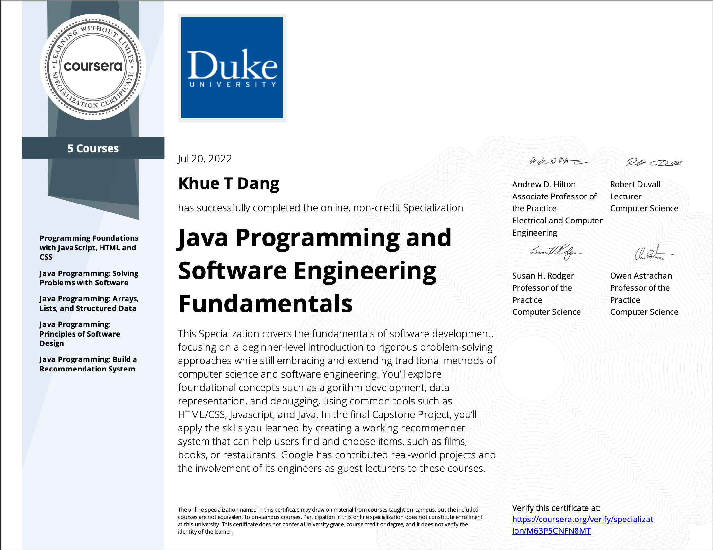

# Java Programming and Software Engineering Fundamentals Specialization
- This repo contains all of my assignments from the Coursera Specialization: [Java Programming and Software Engineering Fundamentals](https://www.coursera.org/specializations/java-programming#courses)

## Table of Content
- Course 1: [Programming Foundations with JavaScript, HTML and CSS](https://www.coursera.org/learn/duke-programming-web?specialization=java-programming)
  * Week 1: Designing a Web Page with HTML and CSS
    1. my-interests-html-only
    2. my-interests-with-css-added
  * Week 2: Algorithms and Programming Concepts
    1. DukeLearnToProgram-env-trial
    2. try-it-using-vars-methods-functions
    3. rampup-variables-methods-functions
    4. try-it-using-for-loops
    5. rampup-loops-and-conditionals
    6. programming-exercise-modifying-images
    7. the-green-screen-algorithm
    8. programming-exercise-avanced-modifying-images
  * Week 3: JavaScript for Web Pages
    1. try-it-buttons-with-divs
    2. try-it-Change-pages-interactively
    3. programming-exercise-todo-list
    4. try-it-canvas
    5. try-it-inputs-and-events
    6. programming-exercise-an-interactive-paint-canvas
    7. try-it-upload-and-display-an-image
    8. try-it-convert-an-image-to-grayscale
    9. try-it-green-screen-online
  * Week 4: MiniProject - Image Filters on the Web
    1. filter-fun
    2. steganography-programming-exercise
- Course 2: [Java Programming: Solving Problems with Software](https://www.coursera.org/learn/java-programming?specialization=java-programming)
  * Week 1: Fundamental Java Syntax and Semantics
    1. hello
    2. perimeter
    3. perimeter-assignment
  * Week 2: Strings in Java
    1. find-gene-simple-and-test
    2. strings-first-assignments
    3. find-gene-while
    4. three-stop-codons
    5. strings-second-assignments
    6. debugging-code
    7. storage-resource
    8. strings-third-assignments
  * Week 3: CSV Files and Basic Statistics in Java
    1. first-csv
    2. exports
    3. parsing-export-data
    4. hottest-temp
    5. hottest-temp-multiple-datasets
    6. hottest-temp-multiple-datasets-refactored
    7. parsing-weather-data
  * Week 4: MiniProject - Baby Names
    1. baby-names
    2. make-gray-single
    3. make-gray-batch
    4. image-saver
    5. invert-images
- Course 3: [Java Programming: Arrays, Lists, and Structured Data](https://www.coursera.org/learn/java-programming-arrays-lists-data?specialization=java-programming)
  * Week 1 - Cryptography - Keeping Information Secret
    1. character-demo
    2. caesar-cipher
    3. implementing-the-caesar-cipher
    4. dice-rolling
    5. common-words
    6. breaking-the-caesar-cipher
    7. object-oriented-caesar-cipher
    8. cryptography-quiz
  * Week 2 - GladLibs - Stories from Templates
    1. count-words
    2. word-frequencies
    3. words-with-arrays
    4. telling-a-random-story
    5. glad-lib
    6. word-frequencies-map
    7. improving-GladLibs
  * Week 3 - Web Server Logs - From Logs to Visits
    1. log-entry
    2. web-log-program
    3. finding-unique-ip-addresses
    4. counting-website-visits
  * Week 4 - MiniProject - Vigenère Cipher
    + vigenere-program
- Course 4: [Java Programming: Principles of Software Design](https://www.coursera.org/learn/java-programming-design-principles?specialization=java-programming)
  * Week 1 - Earthquakes - Programming and Interfaces
    1. earthquake-magnitude-distance-demo
    2. closest-quakes-demo
    3. searching-earthquake-data
    4. earthquake-filter
  * Week 2 - Earthquakes - Sorting Algorithms
    1. selection-sort-demo
    2. in-place-sort-demo
    3. earthquake-sort
    4. time-sort-demo
    5. quake-sort-demo
    6. distance-comparator-demo
    7. efficient-sort
  * Week 3 - N-Grams - Predictive Text
    1. random-text
    2. interface-abstract
    3. word-n-gram
    4. word-gram-class
  * Week 4 - Java - Tools and Libraries for Everyone
- Course 5: [Java Programming: Build a Recommendation System](https://www.coursera.org/learn/java-programming-recommender?specialization=java-programming)
  * Week 1 - Introducing the Recommender
    + step-one
  * Week 2 - Simple Recommendations
    + step-two
  * Week 3 - Interfaces, Filters, Database
    + step-three
  * Week 4 - Weighted Averages
    + step-four
    + step-five

## My learning journey
When I started this specialization, I had already graduated with a Bachelor's Degree in Computer Science from an unnoteworthy university in the United States. Even though I started with Computer Science for the first time with absolutely no previous experience in the second semester of my freshmen year, it was not until the beginning of my senior year did I really learn Computer Science in a proper and efficient way. My first 2 years and a half had been a real struggle with coding and learning new technical skills. Since I had no interest in the field when I started and I just chose to switch my major from Art to Comp Sci with the hope of getting a good job after graduating, learning to code, trying to understand the code, debugging, applying logical thinking, and so on were a real nightmare. I got depressed for quite a while. I went to classes just to fall asleep all along, I could never concentrate no matter how hard I tried. The consequence of it was that I never understood what my professors were talking about, I knew literally NOTHING. I managed to pass all my classes with (quite) a good grade thanks to the great support of my friends who helped me debug my code and by learning by heart what was mentioned in the slides and with a good amount of luck, my exam scores were not too bad. Moreover, for many of my classes, my professors were not that strict, so it was not hard to get an A. Despite the fact that I got some kind of technical jobs during college to put on my resume, those were not that technical. By that I mean, if you look at my previous experience on my LinkedIn profile, you will see what I did was not as serious as what a real SWE intern or undergrad research assistant did. But the real problem is, after all, I forgot everything I had learned since I did not understand it in depth, I still knew nothing and coding had become something scarier and scarier to me when I could not even wrap my mind around my code, I just copied from the slides, here and there, and combined them together, tons of bugs happened without me being aware of what was going on. Thankfully, my friends came and helped me debug so I could feel relieved. I failed so hard after tons of attempts to learn Data Structures, Algorithms, and object-oriented programming. I took a few courses outside of college but my concentration skill was so bad that I kept falling asleep during those classes. There was a time when just opening my computer could make me yawn and feel sleepy already. Thinking about coding made me so frustrated. While so many people out there that I knew from my college or others were doing so well, getting fancy offers from dream companies and talking confidently about Data Structures, Algorithms, and coding interview stuffs, I felt nothing but a huge gap in my knowledge. I was asking myself, how could I become a software engineer when I was so scared of coding? And even if I could manage to get a job at a small company, how would I perform at work? I would be fired soon for sure.

Fortunately, things did not work out that way, I was lucky enough to meet someone who always means a lot to me. I would say he is my very first true mentor, the first to help me learn to code and get the point of Data Structures and Algorithms little by little. Thanks to his patience and perseverance in teaching someone who was so bad at coding like me, the logic started to make sense to me and I could manage to solve coding questions. Once I felt more confident, I thought I could do better and get better every day. Since then, I have been improving consistently. It was always hard for me, but I was trying so hard too. Eventually, everything has become clearer as I did not mind spending all of my free time, weekends, breaks, literally anytime I can just to practice coding and dig deeper and deeper into it. My debugging skills have got better when at least, I am not freaking out whenever an error message shows up or making the same mistakes again and again as I used to anymore. My concentration has improved significantly as I hardly fall asleep when learning online courses and working on my project or any coding problem. After my graduation, my whole summer was well-spent on learning technical skills. I have touched on Web Development, a little cross-platform Mobile Development, new programming languages, Version Control, problem-solving, and Object-oriented programming in Java. I took Object-oriented programming in Java in my junior year in college. It was my hardest time then and I have forgot almost everything about Java and OOP after passing that class. Now, since I know that Java is an essential skill for my job (yeah, I managed to get a job), I have decided to learn it again, although I used to hate it a lot. I found a really good specialization offered by Duke University through Coursera and enrolled without a second thought. Throughout the course, I got exposed to so many things from basic web development with HTML, CSS, and JavaScript, core Java, and some principles of Software Design to finishing a capstone project using everything I have learned in the specialization. I got the chance to work on lots of coding assignments which were easy at first but more challenging towards the end. I was so surprised that I could spend hours working on those without yawning and I have found Java so interesting and powerful. I feel really grateful for the rigorous training and the thoughtful contents of this specialization. After 2 weeks and a half of just staying home and learning, I have finished 5 courses in this specialization, woohoo. I am about to start the Object Oriented Java Programming specialization today. I am more passionate about coding and programming now, I can learn it non-stop. One thing I have learned and it is so true: If you want to be good at something, just keep doing it! That’s the only way. So here is my achievement, I’m ready for the next challenge!

To all the friends who have helped me debug my code and taught me new technical stuff, thank you so much. I am grateful for all my instructors from college and online courses on different platforms too. And finally, I could not have overcome the hardship without my beloved mentor who was the first to truly help me shed some light on Data Structures and Algorithms so that I could build up a foundation in Comp Sci all over again during the past year. Thank you all so much, I’m so grateful for all the challenges, hardships, and rewards to grow from a technophobe to a technophile.

